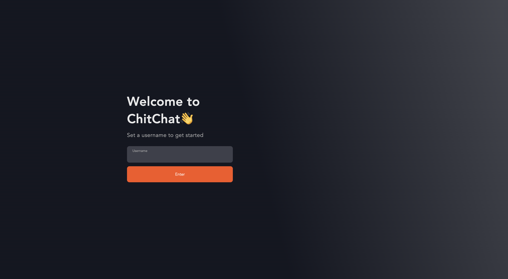

# ChitChat - A React Chatbot

This is a chatbot application built using React.js for the frontend, Node.js for the backend, and the [ChatEngine.io](https://chatengine.io/) API for the chat functionality. The application uses the `react-chat-engine-pretty` package to provide a sleek and modern chat interface.

## Features

- Real-time chat messaging
- User authentication and creation
- Ability to create and join chat rooms
- Ability to share files

## Screenshots

### Login Screen


### Person A


### Person B


## Prerequisites

Before running this project, make sure you have the following installed:

- Node.js (v12 or later)
- npm (Node Package Manager)

## Getting Started

1. Clone the repository:
  ```bash
  git clone https://github.com/quicksilver812/chitchat.git
  ```

2. Navigate to the project directory and install dependencies:
  ```bash
  cd chitchat
  npm install
  ```

3. Create a project on [ChatEngine.io](https://chatengine.io/)
   
4. Navigate into the `backend` directory:
  ```bash
  cd chitchat
  ```
5. Create a `.env` file and add your Private Key from [ChatEngine.io](https://chatengine.io/):
   ```bash
   PRIVATE_KEY="Your_Private_Key_Here"
   ```
6. Run the backend server:
   ```bash
   npm run start
   ```
7. Navigate to the `frontend` directory next and install dependencies:
   ```bash
   cd ../frontend
   ```
8. Create a `.env.local` file and add your Project ID from [ChatEngine.io](https://chatengine.io/):
   ```bash
   VITE_CHAT_ENGINE_PROJECT_ID="Your_Project_ID"
   ```
9. Run the react server:
    ```bash
    npm run dev
    ```
    This will start the React development server, and you can access the application at `http://localhost:5173`.

## Contributing

Contributions are welcome! If you find any issues or have suggestions for improvements, please create a new issue or submit a pull request.

## License

This project is licensed under the MIT License.
